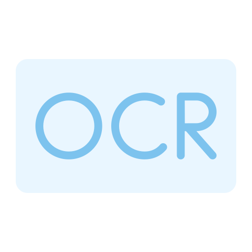
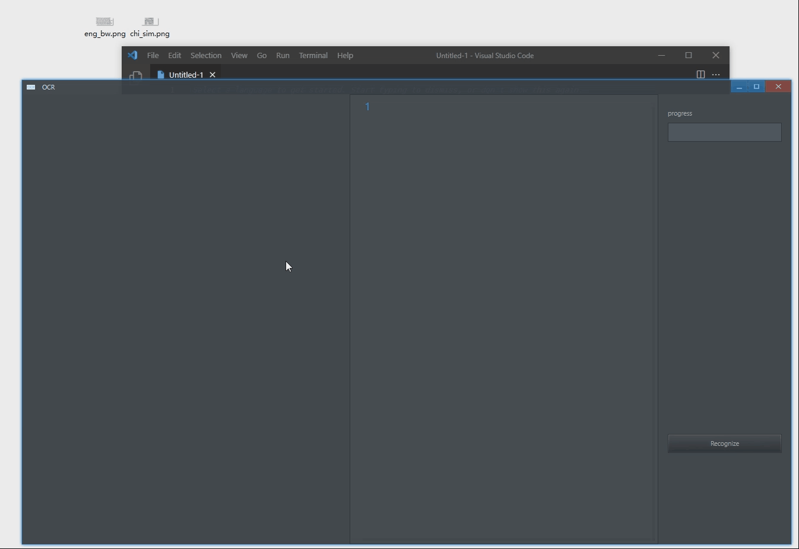
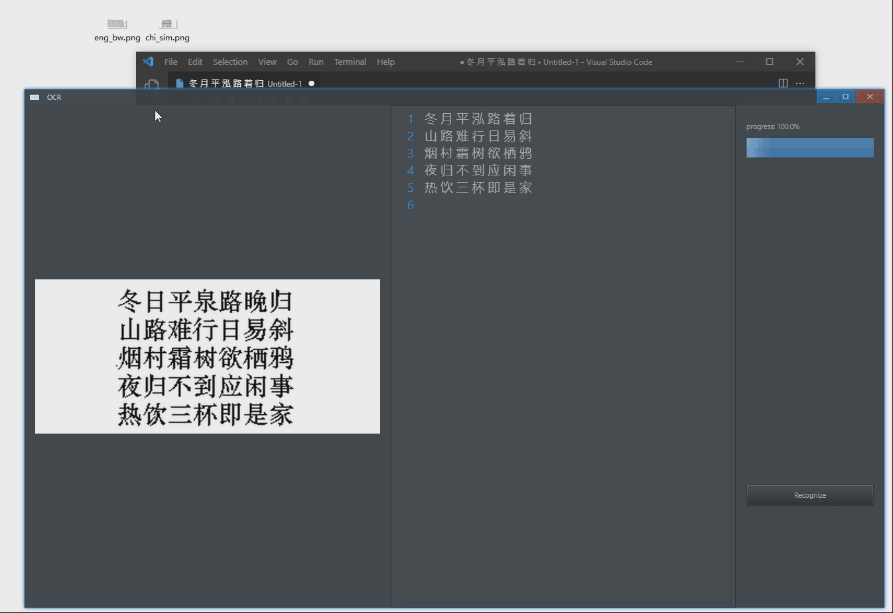
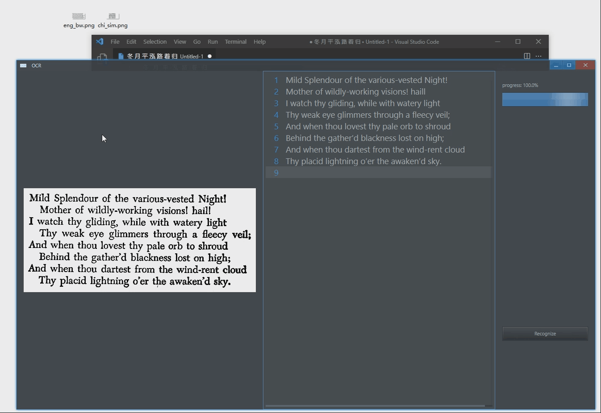
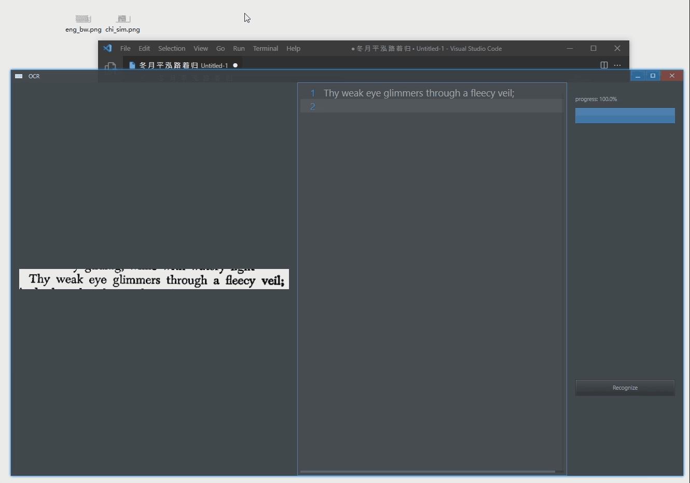

<p align="center">
    
</p>

<!-- <h1 align="center">OCR</h1> -->

<div align="center">

[](https://github.com/rerender2021/ocr/actions/workflows/build.yml) [](https://github.com/rerender2021/ocr/actions/workflows/pack.yml)

 </div>
 
# Introduction

This is powered by [Avernakis React](https://qber-soft.github.io/Ave-React-Docs/) & [Tesseract.js](https://github.com/naptha/tesseract.js). 😀

It supports Chinese and English out of box.

# Install

Download it from [Github Release](https://github.com/rerender2021/ocr/releases).

# Features

- drag and drop to open





- `Ctrl + V`: paste image from clipboard or file





- `Ctrl + C`: copy recognized text to clipboard

# Dev

```bash
> npm install
> npm run dev
```

# Package

```bash
> npm run release
```

# License

[MIT](./LICENSE)
